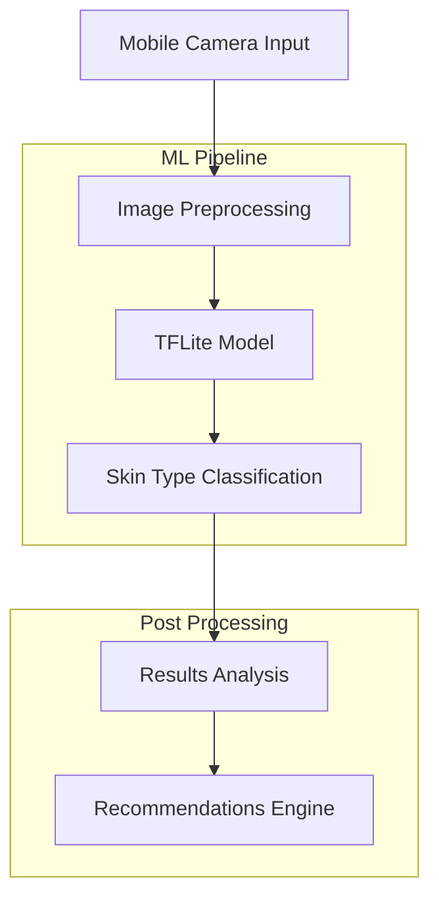
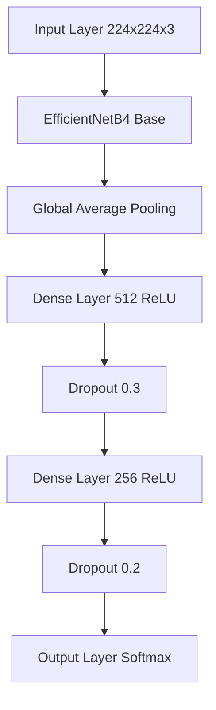

# CeKulit Machine Learning Documentation

<div align="center">
  
  <p><i>AI-Powered Skin Type Analysis and Care Recommendations</i></p>
</div>

## Table of Contents
- [Project Overview](#project-overview)
- [System Architecture](#system-architecture)
- [Machine Learning Pipeline](#machine-learning-pipeline)
- [Technologies Used](#technologies-used)
- [Implementation Guide](#implementation-guide)
- [Model Documentation](#model-documentation)
- [Testing and Validation](#testing-and-validation)
- [Deployment Guide](#deployment-guide)
- [Progress Reports](#progress-reports)
- [Future Development](#future-development)
- [Team and Contributors](#team-and-contributors)

## Project Overview

CeKulit implements advanced machine learning technology for accurate skin type classification using smartphone camera images. Our system helps users identify their skin type (oily or dry) and provides personalized skincare recommendations based on sophisticated image analysis.

### Problem Statement
According to WHO data, over 900 million people globally are impacted by skin conditions, with limited access to dermatological care creating significant barriers to treatment. CeKulit addresses this by providing accessible, AI-powered skin analysis tools.

### Key Features
- Real-time skin type classification
- Privacy-focused on-device inference
- Personalized skincare recommendations
- Cross-lighting condition support
- Offline functionality

### Target Metrics
```markdown
┌────────────────────┬─────────────┐
│ Metric             │ Target      │
├────────────────────┼─────────────┤
│ Model Accuracy     │ >90%        │
│ Inference Time     │ <2 seconds  │
│ Model Size         │ <50MB       │
│ False Positive     │ <5%         │
└────────────────────┴─────────────┘
```

## System Architecture



## Machine Learning Pipeline

### Data Collection and Preprocessing
- **Dataset Composition**
  - Training set: 80%
  - Validation set: 10%
  - Test set: 10%

- **Image Preprocessing Steps**
  ```python
  # Sample preprocessing pipeline
  def preprocess_image(image):
      # Resize to standard dimensions
      image = tf.image.resize(image, (224, 224))
      # Normalize pixel values
      image = image / 255.0
      # Apply data augmentation
      image = apply_augmentation(image)
      return image
  ```

### Model Architecture



### Training Process
```python
# Model compilation configuration
model.compile(
    optimizer=tf.keras.optimizers.Adam(learning_rate=1e-4),
    loss='categorical_crossentropy',
    metrics=['accuracy']
)

# Training parameters
EPOCHS = 50
BATCH_SIZE = 32
STEPS_PER_EPOCH = len(train_dataset) // BATCH_SIZE
```

## Technologies Used

### Core ML Stack
- **Python** 3.8+
- **TensorFlow** 2.x
- **Keras**
- **EfficientNetB4**
- **OpenCV**
- **scikit-learn**
- **TensorFlow Lite**

### Development Tools
- **Jupyter Notebook**
- **Selenium** (testing)
- **Git** (version control)
- **Docker** (containerization)

### Cloud Infrastructure
- **Google Cloud Platform**
  - AI Platform
  - Cloud Storage
  - Cloud Functions

## Implementation Guide

### Environment Setup
```bash
# Create virtual environment
python -m venv cekulit-env

# Activate environment
source cekulit-env/bin/activate  # Unix
cekulit-env\Scripts\activate     # Windows

# Install requirements
pip install -r requirements.txt
```

### Model Training
```bash
# Start training
python train.py --epochs 50 --batch-size 32 --learning-rate 1e-4
```

### Model Optimization
```bash
# Convert to TFLite
python convert_to_tflite.py --model-path ./models/skin_classifier.h5
```

## Model Documentation

### Performance Metrics

<p align="center">
  
</p>

```tsx
import { LineChart, Line, XAxis, YAxis, CartesianGrid, Tooltip, Legend } from 'recharts';

const data = [
  { epoch: 1, training: 0.65, validation: 0.60 },
  { epoch: 10, training: 0.78, validation: 0.75 },
  { epoch: 20, training: 0.85, validation: 0.82 },
  { epoch: 30, training: 0.89, validation: 0.86 },
  { epoch: 40, training: 0.92, validation: 0.88 },
  { epoch: 50, training: 0.94, validation: 0.91 }
];

export default () => (
  <div className="w-full h-64">
    <LineChart width={600} height={300} data={data}>
      <CartesianGrid strokeDasharray="3 3" />
      <XAxis dataKey="epoch" />
      <YAxis />
      <Tooltip />
      <Legend />
      <Line type="monotone" dataKey="training" stroke="#8884d8" name="Training Accuracy" />
      <Line type="monotone" dataKey="validation" stroke="#82ca9d" name="Validation Accuracy" />
    </LineChart>
  </div>
);

```

### Confusion Matrix
```
              Predicted
              Oily  Dry
Actual  Oily   92%   8%
        Dry    5%   95%
```

## Testing and Validation

### Unit Tests
```bash
# Run unit tests
python -m pytest tests/

# Run specific test suite
python -m pytest tests/test_model.py
```

### Integration Tests
- API endpoint testing
- Mobile integration testing
- Performance benchmarking

## Deployment Guide

### Model Deployment
1. Export trained model
2. Convert to TFLite
3. Optimize for mobile
4. Deploy to production

### API Integration
```python
# Sample API endpoint
@app.route('/predict', methods=['POST'])
def predict():
    image = request.files['image']
    result = model.predict(preprocess_image(image))
    return jsonify({
        'skin_type': result.prediction,
        'confidence': float(result.confidence)
    })
```

## Progress Reports

### Week 1: Initial Development
- ✅ Dataset collection complete
- ☐ Basic model architecture designed
- ☐ Training pipeline established

### Week 2: Model Development
- ☐ Model optimization implemented
- ☐ Hyperparameter tuning complete
- ☐ Cross-validation framework setup

### Week 3: Integration
- ☐ Mobile optimization complete
- ☐ Edge cases handled
- ☐ Performance optimized

### Week 4: Final Testing
- ☐ Model evaluation complete
- ☐ Documentation updated
- ☐ Deployment preparation finished

## Future Development

### Planned Features
1. Multi-class skin condition detection
2. Real-time analysis improvements
3. Enhanced recommendation system
4. Integration with skincare product databases

### Research Areas
- Advanced lighting normalization
- Multi-modal analysis
- Personalized AI recommendations

## Team and Contributors

### Machine Learning Team
- **Jasson Franklyn Wang** (Universitas Sebelas Maret)
  - Model Architecture Design
  - Training Pipeline Development

- **Fadhil Yusuf** (Universitas Sebelas Maret)
  - Data Processing
  - Model Optimization

- **Kemas Muhammad Riski Aditia** (Universitas Hang Tuah Pekanbaru)
  - Integration Testing
  - Documentation

### Project Advisors
- [Advisor Name] - Nurrahman Hadi
- [Advisor Name] - Candra Reza Prasetya Gannes

## License
This project is licensed under the MIT License - see the [LICENSE.md](LICENSE.md) file for details.

## Acknowledgments
- WHO for global skin health statistics
- Anthropic for AI assistance
- Our university partners for resources and support

---

<div align="center">
  <p>Made with ❤️ by CeKulit Team</p>
  <p>© 2024 CeKulit. All rights reserved.</p>
</div>
